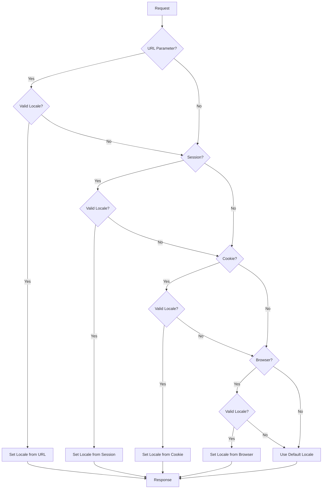

# System Patterns: PLASCHEMA

## System Architecture

### Overview

PLASCHEMA follows a modified MVC (Model-View-Controller) architecture with additional layers for improved separation of concerns:

```
┌─────────────────┐     ┌─────────────────┐     ┌─────────────────┐
│     Routes      │────▶│   Controllers   │────▶│     Views       │
└─────────────────┘     └────────┬────────┘     └─────────────────┘
                                ┌▼┐
                        ┌───────┴───────┐
                        │   Services    │
                        └───────┬───────┘
                                ┌▼┐
                        ┌───────┴───────┐     ┌─────────────────┐
                        │ Repositories  │────▶│     Models      │
                        └───────────────┘     └─────────────────┘
```

### Layer Responsibilities

1. **Routes** (`routes/web.php`, `routes/api.php`)

   - Define URI paths and map them to controller actions
   - Group related routes with middleware assignment
   - Implement route naming for reverse routing

2. **Controllers** (`app/Http/Controllers/`)

   - Handle HTTP requests and return responses
   - Validate input data via Form Requests
   - Coordinate between services and views
   - Remain thin with minimal business logic

3. **Services** (`app/Services/`)

   - Encapsulate business logic and domain rules
   - Orchestrate operations that span multiple repositories
   - Handle transaction management for complex operations
   - Implement business-specific validation

4. **Repositories** (`app/Repositories/`)

   - Abstract database access from business logic
   - Encapsulate complex query logic
   - Provide reusable data access methods
   - Enable easier unit testing through abstraction

5. **Models** (`app/Models/`)

   - Define database schema and relationships
   - Implement scopes for common query conditions
   - Utilize accessors/mutators for data transformation
   - Define validation rules (when simple)

6. **Views** (`resources/views/`)
   - Blade templates for HTML generation
   - Organized by section (admin, public)
   - Component-based approach for reusability
   - Layout inheritance for consistent structure

## Key Technical Decisions

### Backend Framework: Laravel 10

- **Rationale**: Robust ecosystem, strong security features, excellent documentation
- **Benefits**: Rapid development, built-in authentication, ORM (Eloquent)
- **Tradeoffs**: Heavier than microframeworks, learning curve for newcomers

### Frontend Approach: Blade + TailwindCSS + Alpine.js

- **Rationale**: Server-rendered views with minimal JS for simplicity
- **Benefits**: SEO-friendly, reduced complexity, lower maintenance
- **Tradeoffs**: Less dynamic UX compared to SPA frameworks

### Database: MySQL

- **Rationale**: Widely supported, reliable, sufficient for project needs
- **Benefits**: Excellent Laravel integration, familiar to team
- **Tradeoffs**: Some scalability limitations compared to NoSQL solutions

### Image Storage: Local Filesystem (dev) / S3 (prod)

- **Rationale**: Simple development, scalable production
- **Benefits**: Laravel Filesystem abstraction for easy switching
- **Tradeoffs**: Additional configuration for production deployment

### Authentication: Laravel Breeze

- **Rationale**: Lightweight auth scaffolding with minimal dependencies
- **Benefits**: Clean implementation, easily customizable
- **Tradeoffs**: Fewer built-in features compared to Jetstream

### Validation: Form Requests

- **Rationale**: Separate validation logic from controllers
- **Benefits**: Reusable validation rules, cleaner controllers
- **Tradeoffs**: Additional files to maintain

## Design Patterns

### Repository Pattern

- **Implementation**: Interface-based repositories with concrete implementations
- **Examples**: `NewsRepository`, `HealthcareProviderRepository`
- **Benefits**: Decouples business logic from data access, facilitates testing

### Service Layer Pattern

- **Implementation**: Service classes that orchestrate complex operations
- **Examples**: `NewsService`, `HealthcareProviderService`
- **Benefits**: Encapsulates business logic, promotes reusability

### Dependency Injection

- **Implementation**: Constructor injection for service and repository dependencies
- **Examples**: Controllers inject services, services inject repositories
- **Benefits**: Loose coupling, testability, clear dependencies

### Form Request Pattern

- **Implementation**: Dedicated request classes for validation logic
- **Examples**: `StoreNewsRequest`, `UpdateHealthcareProviderRequest`
- **Benefits**: Decouples validation from controllers, promotes reuse

### View Composer Pattern

- **Implementation**: Share data with specific views automatically
- **Examples**: `AdminViewComposer` for sidebar active state
- **Benefits**: Reduces duplication, centralizes view data preparation

### Factory Pattern

- **Implementation**: Model factories for test data generation
- **Examples**: `NewsFactory`, `HealthcareProviderFactory`
- **Benefits**: Consistent test data, reduced test setup code

## Component Relationships

### Data Model Relationships

```
┌──────────────────┐      ┌──────────────────┐
│       News       │      │     Category     │
├──────────────────┤      ├──────────────────┤
│ id               │      │ id               │
│ title            │      │ name             │
│ content          │◄─────┤ slug             │
│ image            │      │ description      │
│ category_id      │      │ parent_id        │
│ published_at     │      └──────────────────┘
└──────────────────┘               ▲
                                   │
┌──────────────────┐               │
│ HealthcareProvider│               │
├──────────────────┤               │
│ id               │               │
│ name             │               │
│ description      │◄──────────────┘
│ address          │
│ contact_info     │      ┌──────────────────┐
│ specialties      │      │        FAQ       │
│ image            │      ├──────────────────┤
│ category_id      │      │ id               │
└──────────────────┘      │ question         │
                          │ answer           │
                          │ category_id      │◄─┐
                          └──────────────────┘  │
                                                │
                          ┌──────────────────┐  │
                          │      User        │  │
                          ├──────────────────┤  │
                          │ id               │  │
                          │ name             │  │
                          │ email            │  │
                          │ password         │  │
                          │ role             │  │
                          └──────────────────┘  │
                                                │
                          ┌──────────────────┐  │
                          │     Activity     │  │
                          ├──────────────────┤  │
                          │ id               │  │
                          │ user_id          │  │
                          │ action           │  │
                          │ entity_type      │  │
                          │ entity_id        │  │
                          │ created_at       │  │
                          └──────────────────┘  │
                                                │
                          ┌──────────────────┐  │
                          │  CategoryType    │  │
                          ├──────────────────┤  │
                          │ id               │  │
                          │ name             │──┘
                          │ description      │
                          └──────────────────┘
```

### Admin Module Structure

```
┌─────────────────────┐     ┌─────────────────────┐
│  AdminController    │────▶│    AdminService     │
└─────────────────────┘     └─────────────────────┘
         ┌──────────────────────┬───────────────────────┐
         ▼                      ▼                       ▼
┌─────────────────┐    ┌─────────────────┐    ┌──────────────────┐
│ NewsController  │    │ ProviderController   │ FAQController    │
└────────┬────────┘    └────────┬────────┘    └────────┬─────────┘
         │                      │                      │
         ▼                      ▼                      ▼
┌─────────────────┐    ┌─────────────────┐    ┌──────────────────┐
│  NewsService    │    │ ProviderService │    │   FAQService     │
└────────┬────────┘    └────────┬────────┘    └────────┬─────────┘
         │                      │                      │
         ▼                      ▼                      ▼
┌─────────────────┐    ┌─────────────────┐    ┌──────────────────┐
│ NewsRepository  │    │ProviderRepository    │ FAQRepository    │
└─────────────────┘    └─────────────────┘    └──────────────────┘
```

## Code Organization

### Directory Structure

```
app/
├── Console/
│   └── Commands/           # Custom Artisan commands
├── Exceptions/             # Exception handlers
├── Http/
│   ├── Controllers/
│   │   ├── Admin/          # Admin controllers
│   │   └── Public/         # Public controllers
│   ├── Middleware/         # Custom middleware
│   └── Requests/
│       ├── Admin/          # Admin form requests
│       └── Public/         # Public form requests
├── Models/                 # Eloquent models
├── Providers/              # Service providers
├── Repositories/
│   ├── Contracts/          # Repository interfaces
│   └── Eloquent/           # Eloquent implementations
├── Rules/                  # Custom validation rules
├── Services/               # Business logic services
└── ViewComposers/          # View composers

database/
├── factories/              # Model factories
├── migrations/             # Database migrations
└── seeders/                # Database seeders

resources/
├── css/                    # CSS assets
├── js/                     # JavaScript assets
└── views/
    ├── admin/              # Admin views
    ├── components/         # Reusable Blade components
    ├── layouts/            # Layout templates
    └── public/             # Public views

tests/
├── Feature/                # Feature tests
│   ├── Admin/              # Admin feature tests
│   └── Public/             # Public feature tests
└── Unit/                   # Unit tests
    ├── Models/             # Model tests
    ├── Repositories/       # Repository tests
    └── Services/           # Service tests
```

## Consistent Patterns

### Service Method Naming

- `getAll()` - Retrieve all records (with pagination)
- `getById($id)` - Retrieve single record by ID
- `create($data)` - Create new record
- `update($id, $data)` - Update existing record
- `delete($id)` - Delete record
- `restore($id)` - Restore soft-deleted record
- `search($criteria)` - Search records by criteria

### Controller Actions

- `index()` - Display list view
- `create()` - Show creation form
- `store()` - Store new record
- `show($id)` - Display single record
- `edit($id)` - Show edit form
- `update($id)` - Update record
- `destroy($id)` - Delete record

### Validation Rules

- Common validation rules defined in model constants
- Form requests extend base requests with shared functionality
- Custom validation rules in dedicated rule classes

### Error Handling

- Custom exception classes for domain-specific errors
- Global exception handler for consistent formatting
- Detailed logging with context information
- User-friendly error messages with flash messaging

### Testing Strategy

- Feature tests for controller actions and complete flows
- Unit tests for isolated service and repository logic
- Model tests for relationships and scopes
- Database transaction rollback for test isolation
- Factory-generated test data with sensible defaults

## Multilingual Support Patterns

### Translation Management

```
┌──────────────────┐      ┌──────────────────┐      ┌──────────────────┐
│ TranslationController   │ TranslationService│      │    Translation   │
├──────────────────┤      ├──────────────────┤      ├──────────────────┤
│ index()          │      │ get()            │◄─────┤ id               │
│ create()         │─────►│ parseKey()       │      │ locale           │
│ store()          │      │ getFromDatabase()│      │ namespace        │
│ edit()           │      │ getFromFile()    │      │ group            │
│ update()         │      │ createOrUpdate() │      │ key              │
│ destroy()        │      │ delete()         │      │ value            │
│ import()         │      │ importTranslations│      │ is_custom        │
│ export()         │      │ exportTranslations│      │ last_used_at     │
└──────────────────┘      └──────────────────┘      └──────────────────┘
```

### Middleware and Components

```
┌──────────────────┐      ┌──────────────────┐      ┌──────────────────┐
│    SetLocale     │      │ LanguageSwitcher │      │      Blade       │
├──────────────────┤      ├──────────────────┤      ├──────────────────┤
│ handle()         │      │ getLocaleName()  │      │ @lang()          │
│ isValidLocale()  │◄─────┤ getLocaleFlag()  │◄─────┤ __()             │
│ getBrowserLocales│      │ render()         │      │ trans()          │
└──────────────────┘      └──────────────────┘      └──────────────────┘
```

### Language Detection Flow



### Translation Loading Strategy

The translation system uses a multi-layer approach for efficient loading and caching:

1. **Cache Layer**: First attempts to retrieve translations from cache
2. **Database Layer**: If not in cache, checks for custom translations in database
3. **File Layer**: Falls back to language files if not found in database
4. **Fallback Layer**: Uses default language if translation not found in current language

This strategy provides a balance between performance and flexibility, allowing for both static file-based translations and dynamic database-driven translations.

### Key Implementation Patterns

1. **Service-Based Translation Management**:

   - TranslationService encapsulates all translation logic
   - Provides methods for getting, creating, updating, and deleting translations
   - Handles file and database interactions through a unified interface

2. **Middleware Locale Detection**:

   - Priority-based locale detection (URL → Session → Cookie → Browser → Default)
   - Uses HTTP request information to determine user's preferred language
   - Sets application locale and persists user preference

3. **Component-Based UI**:

   - LanguageSwitcher blade component provides reusable UI
   - Supports both dropdown and inline display modes
   - Uses flag icons for visual language identification

4. **Cache-First Architecture**:

   - All translations are cached for performance
   - Cache is automatically invalidated on translation updates
   - Cache keys are generated based on locale, namespace, group, and key

5. **Permission-Based Access Control**:
   - Translation management is restricted to authorized roles
   - Separate permission for managing translations
   - Proper middleware checks in admin routes
