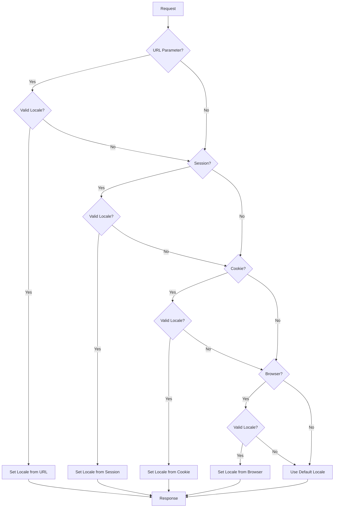
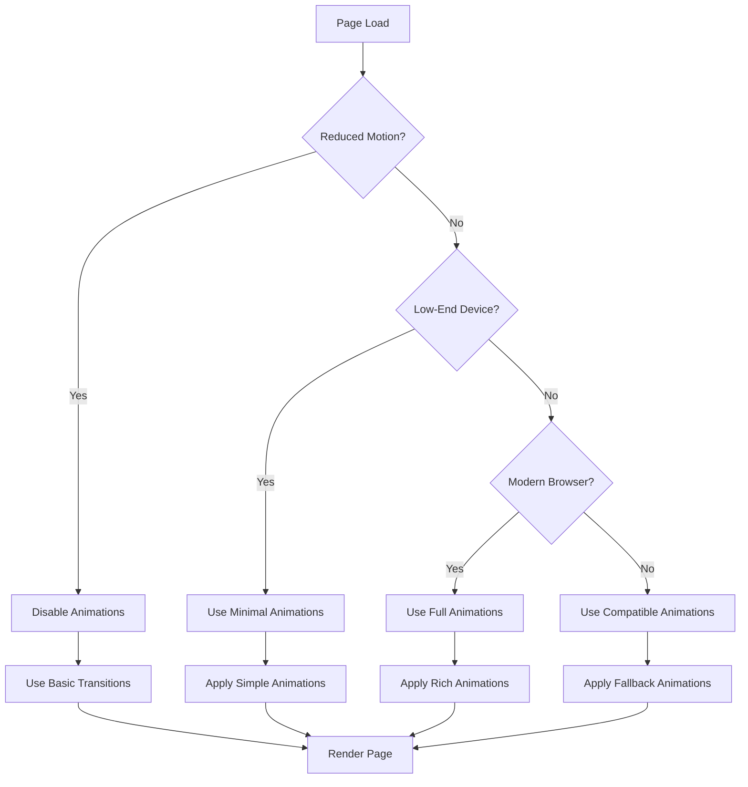

# System Patterns: PLASCHEMA

## System Architecture

### Overview

PLASCHEMA follows a modified MVC (Model-View-Controller) architecture with additional layers for improved separation of concerns:

```
┌─────────────────┐     ┌─────────────────┐     ┌─────────────────┐
│     Routes      │────▶│   Controllers   │────▶│     Views       │
└─────────────────┘     └────────┬────────┘     └─────────────────┘
                                ┌▼┐
                        ┌───────┴───────┐
                        │   Services    │
                        └───────┬───────┘
                                ┌▼┐
                        ┌───────┴───────┐     ┌─────────────────┐
                        │ Repositories  │────▶│     Models      │
                        └───────────────┘     └─────────────────┘
```

### Layer Responsibilities

1. **Routes** (`routes/web.php`, `routes/api.php`)

   - Define URI paths and map them to controller actions
   - Group related routes with middleware assignment
   - Implement route naming for reverse routing

2. **Controllers** (`app/Http/Controllers/`)

   - Handle HTTP requests and return responses
   - Validate input data via Form Requests
   - Coordinate between services and views
   - Remain thin with minimal business logic

3. **Services** (`app/Services/`)

   - Encapsulate business logic and domain rules
   - Orchestrate operations that span multiple repositories
   - Handle transaction management for complex operations
   - Implement business-specific validation

4. **Repositories** (`app/Repositories/`)

   - Abstract database access from business logic
   - Encapsulate complex query logic
   - Provide reusable data access methods
   - Enable easier unit testing through abstraction

5. **Models** (`app/Models/`)

   - Define database schema and relationships
   - Implement scopes for common query conditions
   - Utilize accessors/mutators for data transformation
   - Define validation rules (when simple)

6. **Views** (`resources/views/`)
   - Blade templates for HTML generation
   - Organized by section (admin, public)
   - Component-based approach for reusability
   - Layout inheritance for consistent structure

## Key Technical Decisions

### Backend Framework: Laravel 10

- **Rationale**: Robust ecosystem, strong security features, excellent documentation
- **Benefits**: Rapid development, built-in authentication, ORM (Eloquent)
- **Tradeoffs**: Heavier than microframeworks, learning curve for newcomers

### Frontend Approach: Blade + TailwindCSS + Alpine.js

- **Rationale**: Server-rendered views with minimal JS for simplicity
- **Benefits**: SEO-friendly, reduced complexity, lower maintenance
- **Tradeoffs**: Less dynamic UX compared to SPA frameworks

### Animation & UI Enhancement Strategy

- **Rationale**: Subtle animations and shadows enhance user experience without being distracting
- **Benefits**: Improved perceived quality, better user feedback, professional feel
- **Tradeoffs**: Additional performance considerations, browser compatibility complexity

### Database: MySQL

- **Rationale**: Widely supported, reliable, sufficient for project needs
- **Benefits**: Excellent Laravel integration, familiar to team
- **Tradeoffs**: Some scalability limitations compared to NoSQL solutions

### Image Storage: Local Filesystem (dev) / S3 (prod)

- **Rationale**: Simple development, scalable production
- **Benefits**: Laravel Filesystem abstraction for easy switching
- **Tradeoffs**: Additional configuration for production deployment

### Authentication: Laravel Breeze

- **Rationale**: Lightweight auth scaffolding with minimal dependencies
- **Benefits**: Clean implementation, easily customizable
- **Tradeoffs**: Fewer built-in features compared to Jetstream

### Validation: Form Requests

- **Rationale**: Separate validation logic from controllers
- **Benefits**: Reusable validation rules, cleaner controllers
- **Tradeoffs**: Additional files to maintain

## Design Patterns

### Repository Pattern

- **Implementation**: Interface-based repositories with concrete implementations
- **Examples**: `NewsRepository`, `HealthcareProviderRepository`
- **Benefits**: Decouples business logic from data access, facilitates testing

### Service Layer Pattern

- **Implementation**: Service classes that orchestrate complex operations
- **Examples**: `NewsService`, `HealthcareProviderService`
- **Benefits**: Encapsulates business logic, promotes reusability

### Dependency Injection

- **Implementation**: Constructor injection for service and repository dependencies
- **Examples**: Controllers inject services, services inject repositories
- **Benefits**: Loose coupling, testability, clear dependencies

### Form Request Pattern

- **Implementation**: Dedicated request classes for validation logic
- **Examples**: `StoreNewsRequest`, `UpdateHealthcareProviderRequest`
- **Benefits**: Decouples validation from controllers, promotes reuse

### View Composer Pattern

- **Implementation**: Share data with specific views automatically
- **Examples**: `AdminViewComposer` for sidebar active state
- **Benefits**: Reduces duplication, centralizes view data preparation

### Factory Pattern

- **Implementation**: Model factories for test data generation
- **Examples**: `NewsFactory`, `HealthcareProviderFactory`
- **Benefits**: Consistent test data, reduced test setup code

### Animation Utility Pattern

- **Implementation**: Reusable CSS utility classes for common animations
- **Examples**: `fade-in`, `slide-up`, `hover-lift`
- **Benefits**: Consistent animations, improved maintainability, reduced duplication

### Shadow Elevation System

- **Implementation**: Tiered shadow system based on component elevation
- **Examples**: Shadow levels for cards, buttons, navigation dropdowns
- **Benefits**: Consistent visual hierarchy, improved depth perception

### Batch Processing Pattern

- **Implementation**: Structured data import with validation and error collection
- **Examples**: `HealthcareProvidersImport`, future bulk upload features
- **Benefits**: Efficient data processing, comprehensive error reporting, consistent validation

#### Key Components

1. **Import Class**:

   - Implements Laravel Excel interfaces (`ToCollection`, `WithHeadingRow`, `WithValidation`)
   - Handles validation using Laravel's validation rules
   - Collects and categorizes errors for reporting

2. **Template Generation**:

   - Provides downloadable templates with proper column structure
   - Includes example data and field requirements
   - Uses Excel styling for clear user guidance

3. **Error Reporting**:

   - Structured collection of validation failures
   - Row-specific error identification
   - Exportable error reports for user correction

4. **Duplicate Handling**:
   - Implements configurable duplicate detection strategies
   - Provides options for skipping or updating existing records
   - Tracks statistics on processed, skipped, and failed records

This pattern will be applied consistently across all batch import features in the system, ensuring a uniform approach to data validation, error handling, and user feedback across the application.

## UI Enhancement Patterns

### Animation System

```
┌──────────────────┐      ┌──────────────────┐      ┌──────────────────┐
│  animations.css  │      │  animations.js   │      │ Component Blade  │
├──────────────────┤      ├──────────────────┤      ├──────────────────┤
│ Keyframes        │◄─────┤ intersectionObs  │◄─────┤ Animation Classes│
│ Utility Classes  │      │ performanceCheck │      │ Transition Props │
│ Timing Functions │      │ animationHelpers │      │ Shadow Utilities │
│ Duration Vars    │      │ reducedMotion    │      │ Alpine Directives│
└──────────────────┘      └──────────────────┘      └──────────────────┘
```

### Animation Types and Usage

1. **Transition Animations**:

   - Element state changes (hover, focus, active)
   - Subtle transformations (scale, translate)
   - Color and opacity transitions
   - Short durations (150-300ms)

2. **Entrance Animations**:

   - Content appearing in viewport
   - Page load transitions
   - Progressive/staggered reveals
   - Gentle fade and movement

3. **Feedback Animations**:
   - Form validation responses
   - Action confirmations
   - Loading states
   - Error/success indicators

### Shadow Elevation System

```
┌─────────────────────────────────────────────────────────────┐
│                   Shadow Elevation Tiers                    │
├─────────────┬─────────────┬─────────────┬─────────────┬─────┘
│    None     │     Low     │   Medium    │    High     │
│             │             │             │             │
│ flat items  │ cards       │ dropdowns   │ modals      │
│ disabled    │ buttons     │ popovers    │ dialogs     │
│ elements    │ inputs      │ sticky nav  │ notifications│
│             │             │             │             │
│ shadow-none │ shadow-sm   │ shadow-md   │ shadow-lg   │
└─────────────┴─────────────┴─────────────┴─────────────┘
```

### Performance Optimization Patterns

1. **Reduced Motion Support**

   - Respects user's OS-level preferences
   - Disables or minimizes animations when preferred
   - Maintains core functionality without animation

2. **Browser Compatibility**

   - Graceful degradation for older browsers
   - Feature detection before animation application
   - Fallback shadows for browsers with limited support

3. **Mobile Performance**
   - Simplified animations on mobile devices
   - Device capability detection
   - Optimized shadow rendering
   - Reduced animation complexity on lower-end devices

### Animation Best Practices

1. **Subtlety**: Animations should be subtle and purposeful, not distracting
2. **Performance**: Use transforms and opacity for best performance
3. **Duration**: Keep animations short (150-300ms) for responsive feel
4. **Purpose**: Each animation should serve a specific purpose
5. **Consistency**: Use consistent timing and easing across similar elements
6. **Accessibility**: Always provide reduced-motion alternatives

## Component Relationships

### Data Model Relationships

```
┌──────────────────┐      ┌──────────────────┐
│       News       │      │     Category     │
├──────────────────┤      ├──────────────────┤
│ id               │      │ id               │
│ title            │      │ name             │
│ content          │◄─────┤ slug             │
│ image            │      │ description      │
│ category_id      │      │ parent_id        │
│ published_at     │      └──────────────────┘
└──────────────────┘               ▲
                                   │
┌──────────────────┐               │
│ HealthcareProvider│               │
├──────────────────┤               │
│ id               │               │
│ name             │               │
│ description      │◄──────────────┘
│ address          │
│ contact_info     │      ┌──────────────────┐
│ specialties      │      │        FAQ       │
│ image            │      ├──────────────────┤
│ category_id      │      │ id               │
└──────────────────┘      │ question         │
                          │ answer           │
                          │ category_id      │◄─┐
                          └──────────────────┘  │
                                                │
                          ┌──────────────────┐  │
                          │      User        │  │
                          ├──────────────────┤  │
                          │ id               │  │
                          │ name             │  │
                          │ email            │  │
                          │ password         │  │
                          │ role             │  │
                          └──────────────────┘  │
                                                │
                          ┌──────────────────┐  │
                          │     Activity     │  │
                          ├──────────────────┤  │
                          │ id               │  │
                          │ user_id          │  │
                          │ action           │  │
                          │ entity_type      │  │
                          │ entity_id        │  │
                          │ created_at       │  │
                          └──────────────────┘  │
                                                │
                          ┌──────────────────┐  │
                          │  CategoryType    │  │
                          ├──────────────────┤  │
                          │ id               │  │
                          │ name             │──┘
                          │ description      │
                          └──────────────────┘
```

### Resource Feature Architecture

The resource feature follows the established architecture patterns with some specific considerations for file handling and download tracking:

```
┌─────────────────────┐     ┌─────────────────────┐     ┌─────────────────────┐
│  ResourceController │────▶│   ResourceService   │────▶│ ResourceRepository  │
└─────────────────────┘     └─────────────────────┘     └─────────────────────┘
                                      │                           │
                                      ▼                           ▼
                            ┌─────────────────────┐     ┌─────────────────────┐
                            │    File Storage     │     │    Resource Model   │
                            └─────────────────────┘     └─────────────────────┘
                                                                  │
                                                                  ▼
                                                        ┌─────────────────────┐
                                                        │ ResourceCategory    │
                                                        └─────────────────────┘
```

#### Key Components

1. **ResourceController**:

   - Handles HTTP requests for resource management
   - Implements CRUD operations via the ResourceService
   - Processes file uploads and validation
   - Manages download requests and tracking

2. **ResourceService**:

   - Encapsulates business logic for resource management
   - Handles file storage and retrieval
   - Processes text extraction for searchable content
   - Manages download tracking and analytics
   - Implements caching for resource listings

3. **ResourceRepository**:

   - Abstracts database operations from business logic
   - Handles complex queries for resources
   - Provides methods for filtering and searching
   - Manages download count updates

4. **File Storage**:

   - Uses Laravel's filesystem abstraction
   - Implements organized directory structure
   - Handles mime type validation and security checks
   - Supports multiple file formats (PDF, Excel, Word)

5. **Models**:
   - Resource: Represents downloadable files with metadata
   - ResourceCategory: Organizes resources into categories

#### Resource Download Flow

```
┌──────────┐     ┌──────────────────┐     ┌──────────────────┐
│   User   │────▶│ DownloadController│────▶│  ResourceService │
└──────────┘     └──────────────────┘     └──────────────────┘
                          │                         │
                          ▼                         ▼
                  ┌──────────────────┐     ┌──────────────────┐
                  │     Response     │     │ ResourceRepository│
                  └──────────────────┘     └──────────────────┘
                                                    │
                                                    ▼
                                           ┌──────────────────┐
                                           │  Update Download │
                                           │      Count       │
                                           └──────────────────┘
```

This architecture ensures:

1. Clean separation of concerns
2. Reusable components
3. Efficient file handling
4. Proper tracking of downloads
5. Optimized performance through caching

## Admin Module Structure

```
┌─────────────────────┐     ┌─────────────────────┐
│  AdminController    │────▶│    AdminService     │
└─────────────────────┘     └─────────────────────┘
         ┌──────────────────────┬───────────────────────┐
         ▼                      ▼                       ▼
┌─────────────────┐    ┌─────────────────┐    ┌──────────────────┐
│ NewsController  │    │ ProviderController   │ FAQController    │
└────────┬────────┘    └────────┬────────┘    └────────┬─────────┘
         │                      │                      │
         ▼                      ▼                      ▼
┌─────────────────┐    ┌─────────────────┐    ┌──────────────────┐
│  NewsService    │    │ ProviderService │    │   FAQService     │
└────────┬────────┘    └────────┬────────┘    └────────┬─────────┘
         │                      │                      │
         ▼                      ▼                      ▼
┌─────────────────┐    ┌─────────────────┐    ┌──────────────────┐
│ NewsRepository  │    │ProviderRepository    │ FAQRepository    │
└─────────────────┘    └─────────────────┘    └──────────────────┘
```

## Code Organization

### Directory Structure

```
app/
├── Console/
│   └── Commands/           # Custom Artisan commands
├── Exceptions/             # Exception handlers
├── Http/
│   ├── Controllers/
│   │   ├── Admin/          # Admin controllers
│   │   └── Public/         # Public controllers
│   ├── Middleware/         # Custom middleware
│   └── Requests/
│       ├── Admin/          # Admin form requests
│       └── Public/         # Public form requests
├── Models/                 # Eloquent models
├── Providers/              # Service providers
├── Repositories/
│   ├── Contracts/          # Repository interfaces
│   └── Eloquent/           # Eloquent implementations
├── Rules/                  # Custom validation rules
├── Services/               # Business logic services
└── ViewComposers/          # View composers

database/
├── factories/              # Model factories
├── migrations/             # Database migrations
└── seeders/                # Database seeders

resources/
├── css/
│   ├── app.css            # Main CSS file
│   ├── animations.css     # Animation utilities
│   └── validation.css     # Form validation styles
├── js/
│   ├── app.js             # Main JavaScript file
│   ├── animations.js      # Animation helpers
│   ├── validation.js      # Form validation logic
│   └── accessibility.js   # Accessibility enhancements
└── views/
    ├── admin/              # Admin views
    ├── components/         # Reusable Blade components
    ├── layouts/            # Layout templates
    └── public/             # Public views

tests/
├── Feature/                # Feature tests
│   ├── Admin/              # Admin feature tests
│   └── Public/             # Public feature tests
└── Unit/                   # Unit tests
    ├── Models/             # Model tests
    ├── Repositories/       # Repository tests
    └── Services/           # Service tests
```

## Consistent Patterns

### Service Method Naming

- `getAll()` - Retrieve all records (with pagination)
- `getById($id)` - Retrieve single record by ID
- `create($data)` - Create new record
- `update($id, $data)` - Update existing record
- `delete($id)` - Delete record
- `restore($id)` - Restore soft-deleted record
- `search($criteria)` - Search records by criteria

### Controller Actions

- `index()` - Display list view
- `create()` - Show creation form
- `store()` - Store new record
- `show($id)` - Display single record
- `edit($id)` - Show edit form
- `update($id)` - Update record
- `destroy($id)` - Delete record

### Animation Class Naming

- `fade-in` - Fade in from transparent to opaque
- `fade-out` - Fade out from opaque to transparent
- `slide-up` - Slide up from below
- `slide-down` - Slide down from above
- `scale-in` - Scale from smaller to normal size
- `hover-lift` - Slight elevation on hover
- `hover-grow` - Slight growth on hover
- `hover-glow` - Subtle glow effect on hover

### Shadow Utility Classes

- `shadow-none` - No shadow (flat element)
- `shadow-sm` - Small shadow (low elevation)
- `shadow-md` - Medium shadow (medium elevation)
- `shadow-lg` - Large shadow (high elevation)
- `hover-shadow-md` - Change to medium shadow on hover
- `hover-shadow-lg` - Change to large shadow on hover
- `active-shadow-sm` - Change to small shadow when active

### Validation Rules

- Common validation rules defined in model constants
- Form requests extend base requests with shared functionality
- Custom validation rules in dedicated rule classes

### Error Handling

- Custom exception classes for domain-specific errors
- Global exception handler for consistent formatting
- Detailed logging with context information
- User-friendly error messages with flash messaging

### Testing Strategy

- Feature tests for controller actions and complete flows
- Unit tests for isolated service and repository logic
- Model tests for relationships and scopes
- Database transaction rollback for test isolation
- Factory-generated test data with sensible defaults

## Multilingual Support Patterns

### Translation Management

```
┌──────────────────┐      ┌──────────────────┐      ┌──────────────────┐
│ TranslationController   │ TranslationService│      │    Translation   │
├──────────────────┤      ├──────────────────┤      ├──────────────────┤
│ index()          │      │ get()            │◄─────┤ id               │
│ create()         │─────►│ parseKey()       │      │ locale           │
│ store()          │      │ getFromDatabase()│      │ namespace        │
│ edit()           │      │ getFromFile()    │      │ group            │
│ update()         │      │ createOrUpdate() │      │ key              │
│ destroy()        │      │ delete()         │      │ value            │
│ import()         │      │ importTranslations│      │ is_custom        │
│ export()         │      │ exportTranslations│      │ last_used_at     │
└──────────────────┘      └──────────────────┘      └──────────────────┘
```

### Middleware and Components

```
┌──────────────────┐      ┌──────────────────┐      ┌──────────────────┐
│    SetLocale     │      │ LanguageSwitcher │      │      Blade       │
├──────────────────┤      ├──────────────────┤      ├──────────────────┤
│ handle()         │      │ getLocaleName()  │      │ @lang()          │
│ isValidLocale()  │◄─────┤ getLocaleFlag()  │◄─────┤ __()             │
│ getBrowserLocales│      │ render()         │      │ trans()          │
└──────────────────┘      └──────────────────┘      └──────────────────┘
```

### Language Detection Flow



### Reduced Motion Detection Flow



### Translation Loading Strategy

The translation system uses a multi-layer approach for efficient loading and caching:

1. **Cache Layer**: First attempts to retrieve translations from cache
2. **Database Layer**: If not in cache, checks for custom translations in database
3. **File Layer**: Falls back to language files if not found in database
4. **Fallback Layer**: Uses default language if translation not found in current language

This strategy provides a balance between performance and flexibility, allowing for both static file-based translations and dynamic database-driven translations.

### Key Implementation Patterns

1. **Service-Based Translation Management**:

   - TranslationService encapsulates all translation logic
   - Provides methods for getting, creating, updating, and deleting translations
   - Handles file and database interactions through a unified interface

2. **Middleware Locale Detection**:

   - Priority-based locale detection (URL → Session → Cookie → Browser → Default)
   - Uses HTTP request information to determine user's preferred language
   - Sets application locale and persists user preference

3. **Component-Based UI**:

   - LanguageSwitcher blade component provides reusable UI
   - Supports both dropdown and inline display modes
   - Uses flag icons for visual language identification

4. **Cache-First Architecture**:

   - All translations are cached for performance
   - Cache is automatically invalidated on translation updates
   - Cache keys are generated based on locale, namespace, group, and key

5. **Permission-Based Access Control**:
   - Translation management is restricted to authorized roles
   - Separate permission for managing translations
   - Proper middleware checks in admin routes

### Icon Implementation

```
┌──────────────────┐      ┌──────────────────┐      ┌──────────────────┐
│    Heroicons     │      │   Card Component  │      │     Section      │
├──────────────────┤      ├──────────────────┤      ├──────────────────┤
│ SVG Icons        │─────▶│ Icon Integration  │─────▶│ Semantic Meaning │
│ Standard Sizes   │      │ Consistent Style  │      │ Visual Hierarchy │
│ Accessibility    │      │ Color Matching    │      │ Component Balance│
└──────────────────┘      └──────────────────┘      └──────────────────┘
```

#### Icon Selection Strategy

1. **Health Plans Cards**:

   - Formal Sector: "building-office-2" icon (representing workplace)
   - Informal Sector: "shopping-bag" icon (representing commerce)
   - BHCPF: "heart" icon (representing healthcare)
   - Equity Program: "user-group" icon (representing community)

2. **Statistics Cards**:

   - Enrolled Citizens: "users" icon
   - Healthcare Providers: "building-office" icon
   - Accredited HMOs: "briefcase" icon
   - LGAs Covered: "map" icon

3. **Implementation Approach**:
   - Size: 40px × 40px (w-10 h-10) for card icons, 48px × 48px (w-12 h-12) for statistics
   - Color: Primary brand color for card icons, white for statistics section
   - Position: Above title for cards, above number for statistics
   - Responsive behavior: Properly scaled across different device sizes

### Dynamic News Section Architecture

```
┌──────────────────┐      ┌──────────────────┐      ┌──────────────────┐
│  HomeController  │      │   CacheService   │      │   Home View      │
├──────────────────┤      ├──────────────────┤      ├──────────────────┤
│ Fetch Recent News│◄────▶│ Cache Results    │─────▶│ Loop Through Data│
│ Limit to 3 Items │      │ Invalidate on    │      │ Display Cards    │
│ Sort by Date     │      │ News Updates     │      │ Link to Detail   │
└──────────────────┘      └──────────────────┘      └──────────────────┘
```

#### Implementation Approach

1. **Controller Structure**:

   - Create new HomeController in `app/Http/Controllers`
   - Inject CacheService
   - Method to fetch 3 most recent published news articles
   - Follow established pattern from NewsController
   - Update routes to use controller instead of closure

2. **Caching Strategy**:

   - Cache key based on collection type ("home_recent_news")
   - Cache duration: 1 hour (3600 seconds)
   - Automatic invalidation when news is created/updated
   - Fallback to database query if cache fails

3. **View Updates**:
   - Replace static news cards with Blade loop
   - Handle edge cases (fewer than 3 news items)
   - Maintain consistent card height regardless of content length
   - Use actual news data (title, image, excerpt, date)

### Image Standardization Strategy

```
┌──────────────────┐      ┌──────────────────┐      ┌──────────────────┐
│  Fixed Container │      │  Object-Fit CSS  │      │  Responsive      │
├──────────────────┤      ├──────────────────┤      ├──────────────────┤
│ Set Height/Width │─────▶│ Cover Property   │─────▶│ Maintain Aspect  │
│ Match News Cards │      │ Center Position  │      │ Screen Size Adapt│
│ Consistent Size  │      │ Overflow Hidden  │      │ Loading Behavior │
└──────────────────┘      └──────────────────┘      └──────────────────┘
```

#### Implementation Details

1. **Image Container**:

   - Fixed dimensions matching news card images
   - Overflow hidden to prevent image distortion
   - Rounded corners consistent with other cards

2. **Image Styling**:

   - `object-fit: cover` to maintain aspect ratio
   - `object-position: center` to center the subject
   - Width and height set to 100% to fill container
   - Responsive behavior across device sizes

3. **Application Areas**:
   - Leadership cards on about page
   - News cards on home and news pages
   - Other card images requiring consistency

### Button Color Standardization

```
┌──────────────────┐      ┌──────────────────┐      ┌──────────────────┐
│   Brand Colors   │      │   Button States  │      │   Accessibility  │
├──────────────────┤      ├──────────────────┤      ├──────────────────┤
│ Primary: #10B981 │─────▶│ Default State    │─────▶│ Contrast Ratios  │
│ Hover: #059669   │      │ Hover State      │      │ Focus States     │
│ Text: #FFFFFF    │      │ Active/Focus     │      │ Visible Feedback │
└──────────────────┘      └──────────────────┘      └──────────────────┘
```

#### CSS Classes Structure

1. **Primary Button**:

   - Base: `bg-plaschema text-white`
   - Hover: `hover:bg-plaschema-dark`
   - Transition: `transition-colors duration-200`

2. **Implementation Areas**:
   - Health plans page buttons
   - Other primary action buttons throughout the site
   - Consistent application across all interactive elements

### Search Button Height Adjustment

Target: Match height with adjacent input field, maintaining proper alignment.

Implementation:

1. Remove fixed height if present
2. Align with flexbox using `items-center`
3. Match padding with input field
4. Maintain consistent border-radius and styling
